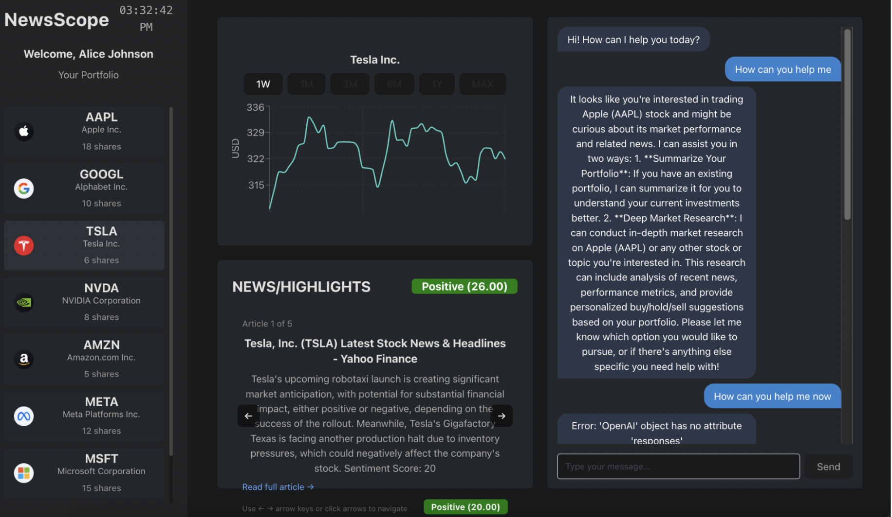
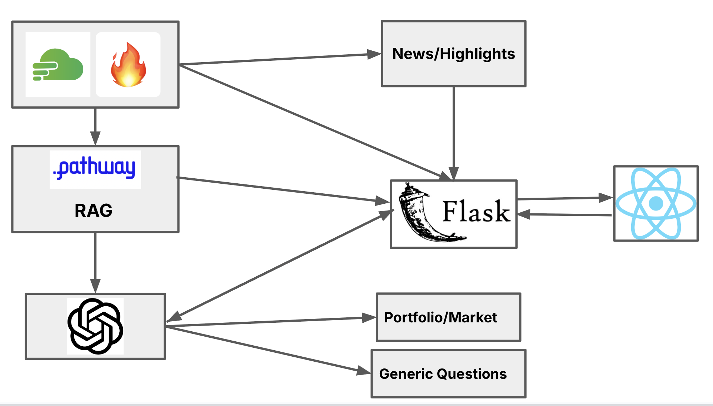

# 📈 NewsScope

[](https://deepwiki.com/Subhrato20/newsscope)

**NewsScope** is an AI-powered financial research dashboard that provides real-time news analysis, sentiment scoring, and a conversational AI assistant to help you make smarter investment decisions.

This project was developed for the **HackwithNewYork** hackathon.

  <!-- It's highly recommended to add a GIF or screenshot of the app here -->



## ✨ Features

- **Interactive Stock Dashboard**: Select from a list of stocks (AAPL, TSLA, etc.) to view detailed information and price charts. Pulled directly from your portfolio and live market data.
- **AI-Powered News Analysis**:
    - Fetches the latest news articles for any selected stock.
    - Generates concise, 1-2 sentence summaries for each article.
    - Performs sentiment analysis to provide a score from -100 (very negative) to +100 (very positive) for each news item.
    - Calculates and displays an average sentiment score to quickly gauge market mood.
- **RAG-Powered Chatbot**:
    - Engage in a conversation with an AI assistant (powered by GPT-4o).
    - The chatbot uses Retrieval-Augmented Generation (RAG) to answer questions using context from the latest fetched news articles, market data, and your current portfolio status.
    - **Function Calling**: The AI can execute tools to:
        - `summarize_user_portfolio`: Analyze and report on your mock portfolio holdings.
        - `deep_market_research`: Conduct a web search on a stock and provide a "Buy," "Hold," or "Sell" recommendation.

[Our Demo](https://drive.google.com/file/d/15-Xc4_8BrDdE8ZMfLcNbJgOLJ4akPosg/view?usp=drive_link)

## 🛠️ Tech Stack

### Backend

- **Framework**: Flask
- **Language**: Python
- **Core Libraries**:
    - `openai`: For all LLM interactions (Chat, Summarization, Embeddings, Function Calling).
    - `firecrawl-py`: For searching and scraping news articles from the web.
    - `Flask-CORS`: To handle cross-origin requests from the frontend.
    - `python-dotenv`: To manage environment variables.
    - `pathway`: RAG pipeline and management

### Frontend

- **Framework**: React + Vite
- **UI Library**: Chakra UI
- **Charting**: Recharts, Lightweight Charts
- **Languages**: JSX, CSS

### APIs & Services

- **OpenAI API**: GPT-4o, GPT-4-Turbo, and `text-embedding-ada-002`.
- **Firecrawl API**: For real-time news aggregation and web content scraping.

## 🚀 Getting Started

Follow these instructions to get a local copy up and running.

### Prerequisites

- **Node.js and npm**: [Download & Install Node.js](https://nodejs.org/)
- **Python 3**: [Download & Install Python](https://www.python.org/downloads/)
- **OpenAI API Key**: Get one from [OpenAI](https://platform.openai.com/api-keys).
- **Firecrawl API Key**: Get one from [Firecrawl](https://www.firecrawl.dev/).

### Backend Setup

1.  **Navigate to the backend directory**:
    ```bash
    cd rolandyangg-newsscope/backend
    ```

2.  **Create and activate a virtual environment**:
    ```bash
    # For macOS/Linux
    python3 -m venv venv
    source venv/bin/activate

    # For Windows
    python -m venv venv
    .\venv\Scripts\activate
    ```

3.  **Install dependencies**:
    ```bash
    pip install -r requirements.txt
    ```

4.  **Configure Environment Variables**:
    Create a file named `.env` in the `backend` directory and add your API keys:
    ```env
    OPENAI_API_KEY="your_openai_api_key"
    ```

    In `backend/search.py` set your Firecrawl API Key

    In `frontend/src/components/Sidebar.jsx` set your Finnhub API Key

    In `frontend/src/components/StockDashboard.jsx` set the Twelve Data API Key

5.  **Configure User Data Path**:
    The backend needs access to the mock user portfolio data. (Ideally in the future we would like this to be managed and uploadable through a UI)
    - Open `backend/tools.py`.
    - Find the line `path = "/Users/subhratosom/NYC/newsscope/data/user_data.json"`.
    - **Change this absolute path** to the correct relative path from the project root:
      ```python
      # Change this:
      path = "/Users/subhratosom/NYC/newsscope/data/user_data.json"
      
      # To this:
      path = "../frontend/public/data/user_data.json" 
      ```
    > This change assumes you run the backend from within the `backend/` directory.

6.  **Run the Backend Server**:
    ```bash
    flask run
    # Or
    python app.py
    ```
    The backend will be running on `http://localhost:8080`.

### Frontend Setup

1.  **Navigate to the frontend directory** (from the root of the project):
    ```bash
    cd rolandyangg-newsscope/frontend
    ```

2.  **Install dependencies**:
    ```bash
    npm install
    ```

3.  **Run the Frontend Development Server**:
    ```bash
    npm run dev
    ```

4.  **Open the App**:
    Open your browser and navigate to the URL provided by Vite (usually `http://localhost:5173`).

## 🏛️ How It Works (Architecture)



- Our project uses Finnbar and Firecrawl to get the most recent up to date market data and news articles relating to a specific stock.
- This scraped data is fed into a RAG using Pathway. We also feed in a users portfolio into RAG.
- A Chatbot reads from the RAG to give generic financial literacy advice and also give market advice based on a users portfolio
- News and Highlights along with an overall sentiment score is calculated using the scraped news articles
- All of this is managed by a Flask backend with several endpoints, connected to a React backend, built atop Vite. 

